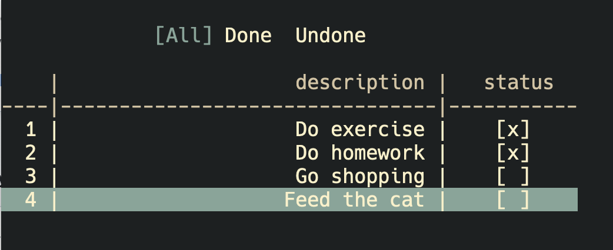

# todo-TUI-rs
Just a simple implementation of Todo app written in Rust, allows user to manage your tasks in a command-line interface with a user-friendly interface.

## Features
- Add new tasks with a description
- View the list of tasks
- Mark tasks as completed
- Remove tasks from the list
- Three ways of viewing tasks: all, done, and undone

### Controls

| Key(s)  | Description                              |
| ------- | ---------------------------------------- |
| `h`, `l`| Switch between ways of viewing tasks      |
| `j`, `k`| Navigate up and down the task list       |
| `x`     | Mark the selected task as done           |
| `a`     | Add a new task                           |
| `d`     | Remove the selected task from the list   |
| `q`     | Quit the application                      |

